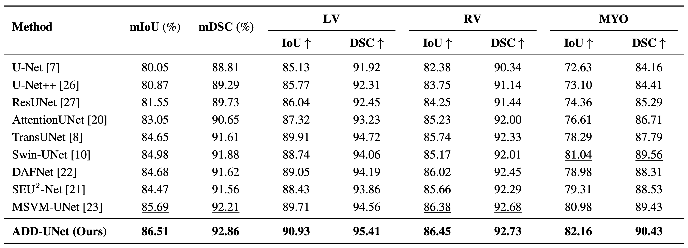
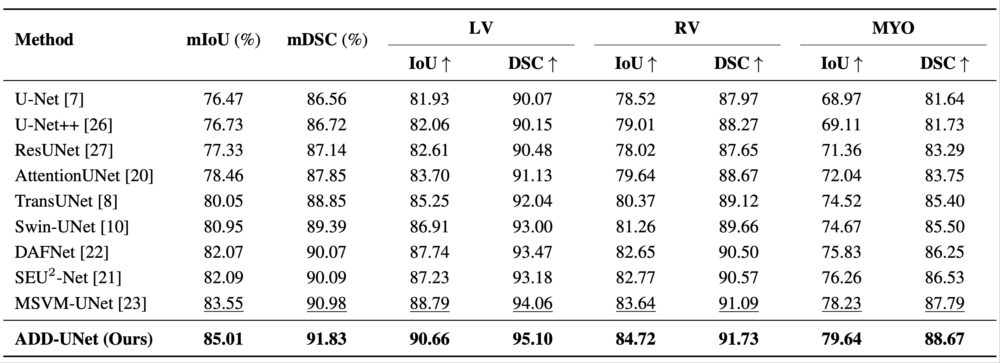
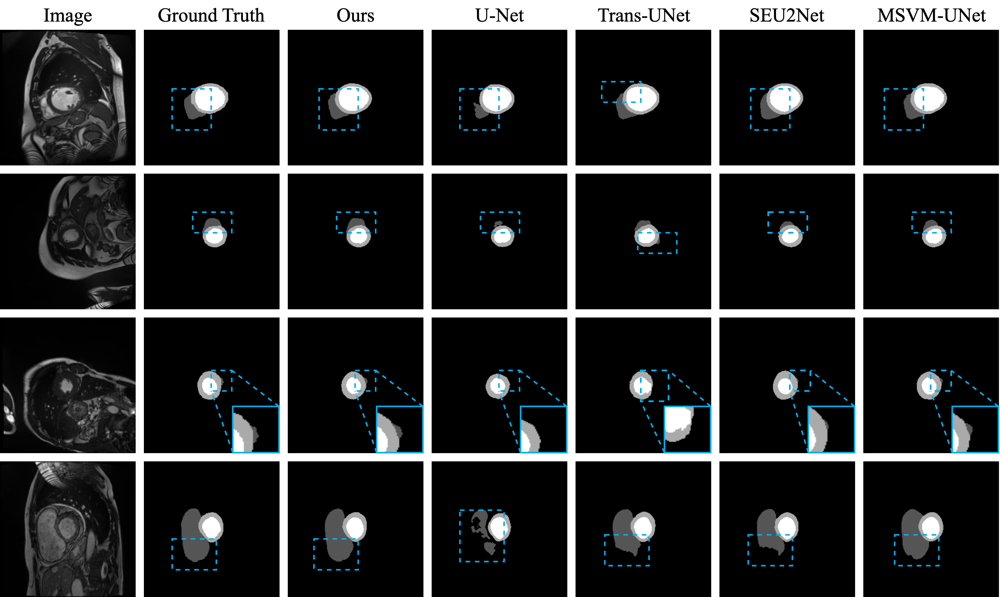
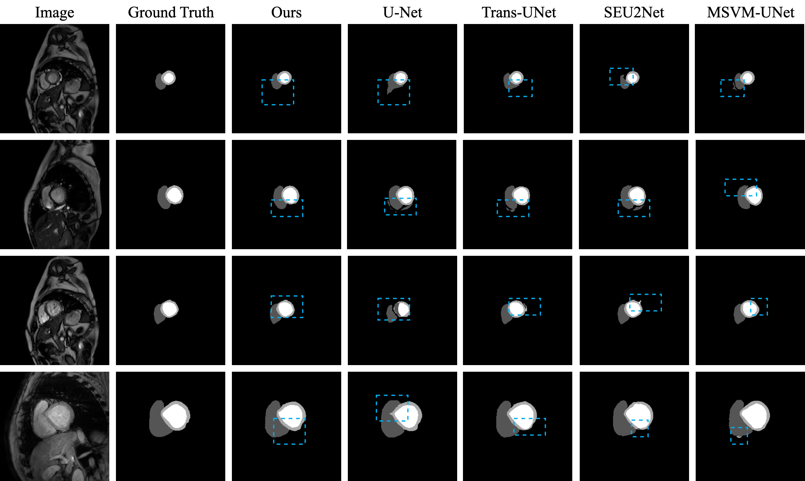

<p align="center">
  
</p>


<h1 align="center">
ADD-UNet: An Efficient and Accurate Network for Cardiac MRI Segmentation to Assist Duchenne Muscular Dystrophy Diagnosis
</h1>


## 📜 Abstract

            Duchenne Muscular Dystrophy (DMD) is an X-linked genetic muscle
            disorder characterized by progressive degeneration of muscle fibers 
            and is often accompanied by cardiac complications. Therefore, 
            timely and accurate assessment of cardiac structure and 
            function is crucial for personalized treatment and disease management.
            Manual delineation of cardiac structures is labor-intensive and subject 
            to inter-observer variability. To address this, we propose ADD-UNet, an
            efficient convolution-attention network that captures both local and global 
            features. Our network incorporates a Lossless Downsampling Block (LDB)
            for multi-frequency feature aggregation, a Global Context Fusion (GCF) block
            for multi-scale feature integration, and a Feature Bridge (FB) block group 
            to optimize gradient flow between adjacent layers. The model is trained on 
            the ACDC dataset and externally validated on 40 DMD patient CMRs from the
            Chinese PLA General Hospital. Experimental results demonstrate that ADD-UNet 
            achieves state-of-the-art performance on both the ACDC and DMD datasets, 
            with mDSC scores of 92.86% and 91.83%, outperforming the previous best method MSVM-UNet 
            by 0.65% and 0.85%, respectively.

## 👨‍⚕️ ADD-UNet
Overall pipeline of the model architecture of ADD-UNet and its modules.

<p align="center">
  
</p>

<p align="center">
  
</p>

<p align="center">
  
</p>

<p align="center">
  
</p>

## Result
Performance comparison between ADD-UNet and other existing models. **Bold** indicates the best performance, and _underline_ indicates the second-best performance.

<p align="center">
  
</p>

<p align="center">
  
</p>


The following demos illustrate a comparison between ADD-UNet and other existing segmentation models on both ACDC and DMD dataset.  The <b><font color="00AEEF"> highlighted blue </font></b> boxes indicate the key difference regions.

**ACDC dataset Segmentation Sample**

<p align="center">
  
</p>

**DMD dataset Segmentation Sample**

<p align="center">
  
</p>

## 📦 Installation

```bash
git clone ../ADD-UNet.git
cd ADD-UNet
conda env create -f addunet.yml
conda activate addunet
```

## 🚀 Quick Start

### 🧠 Dataset
Please organize your dataset according to the following directory structure:
```
data/
├── train/                 
│   ├── image/             # MRI images
│   │   ├── 001.png
│   │   ├── 002.png
│   │   └── ...
│   └── mask/             # Mask
│       ├── 001.png
│       ├── 002.png
│       └── ...
├── val/                   
│   ├── image/
│   │   ├── 101.png
│   │   ├── 102.png
│   │   └── ...
│   └── mask/
│       ├── 101.png
│       ├── 102.png
│       └── ...
└── test/                  
    ├── image/
    │   ├── 201.png
    │   ├── 202.png
    │   └── ...
    └── mask/
        ├── 201.png
        ├── 202.png
        └── ...
```

### ⚙️ Model config
Please configure the model and training hyperparameters in 'local/addunet.yml'.

### ✨ Training
You can run the following command to train the ADD-UNet:
```
python train_baseline.py
```

## 📖 Citation

```bibtex

```


